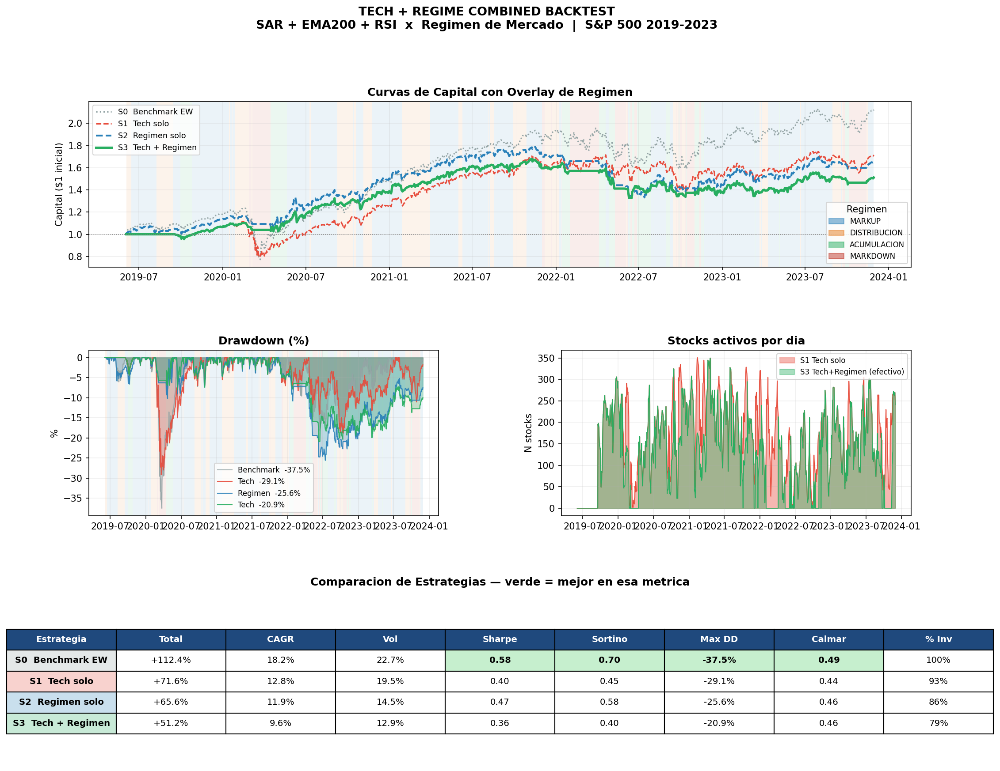
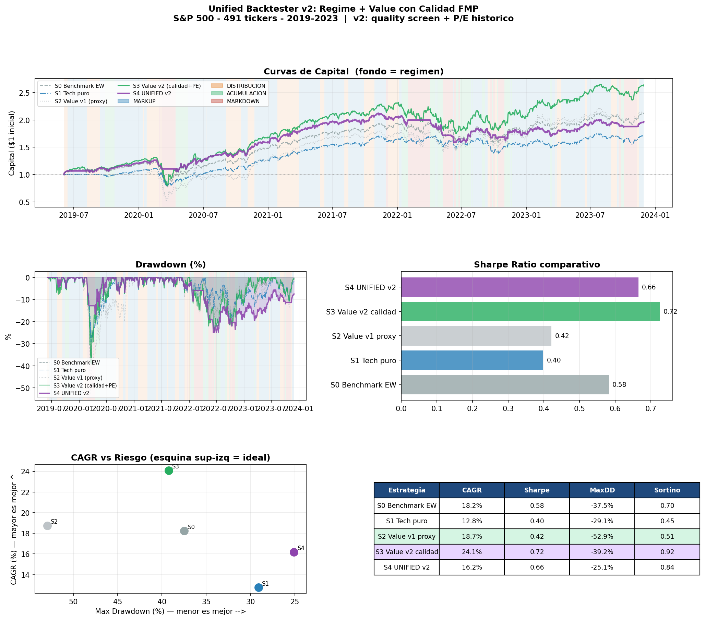
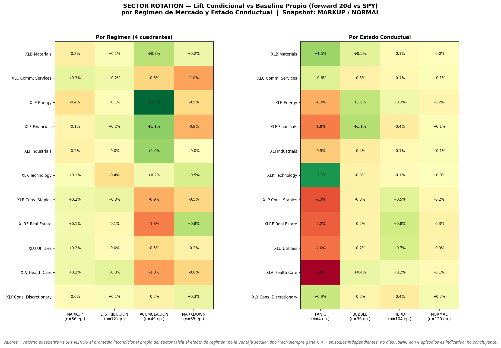
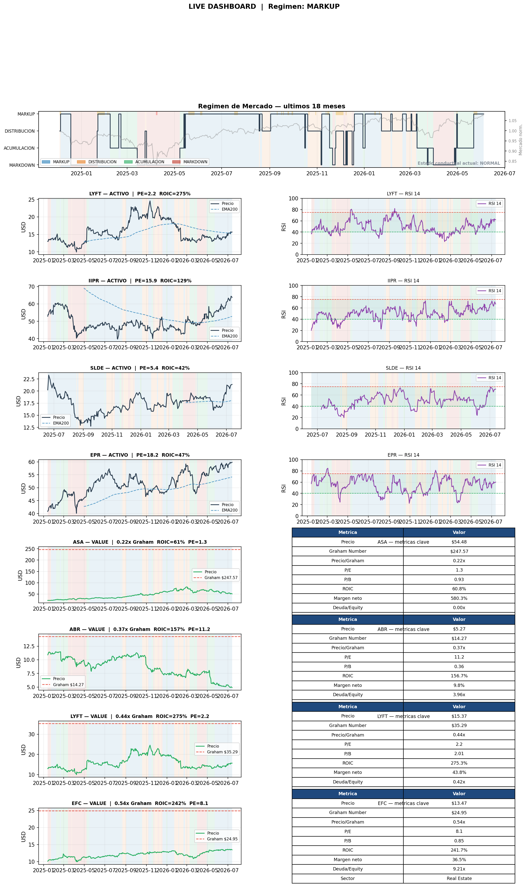

# Regime Strategy Suite

Un pipeline de investigación cuantitativa completo: clasificación de régimen
de mercado → señal técnica → filtro de valor (Graham/Buffett) → backtest
walk-forward → validación cruzada top-down por sector → dashboard de
decisión diaria. Construido y probado sobre **491 acciones del S&P 500
(2018-2023)**.

A diferencia de un backtest aislado, esto documenta el proceso completo de
iteración: la primera versión (señal técnica + régimen) no le ganó al
benchmark en Sharpe. Añadir un filtro de calidad fundamental sí lo hizo — y
eso está reportado explícitamente, no escondido.

---

## El régimen de mercado (4 cuadrantes)

Todo el pipeline se apoya en una clasificación simple de régimen, sobre
tendencia de 60 días × estrés de volatilidad:

| | Estrés bajo | Estrés alto |
|---|---|---|
| **Tendencia positiva** | MARKUP | DISTRIBUCIÓN |
| **Tendencia negativa** | ACUMULACIÓN | MARKDOWN |

`regime_classifier.py` añade una segunda capa — un vocabulario conductual
(PANIC / BUBBLE / HERD / NORMAL) derivado de kurtosis, skew y persistencia de
tendencia rodantes, con percentiles **walk-forward (expanding, sin
look-ahead)**. Es la traducción a datos reales de los hallazgos del
simulador de agentes en
[BehavioralMarket](https://github.com/axelbill19/BehavioralMarket) (mismo
autor, repo separado): ese proyecto probó con un ABM que ciertos sesgos
conductuales producen firmas estadísticas reconocibles; aquí se detectan
esas mismas firmas sobre retornos reales, no se re-simula nada.

## Arquitectura

```
current_regime.py         Régimen HOY + señal técnica sobre 3 candidatos (dashboard diagnóstico)
tech_regime_backtest.py   Backtest v1: SAR+EMA200+RSI × régimen (S0-S3)
unified_backtester_v2.py  Backtest v2: + filtro de calidad FMP y P/E histórico (S0-S4)
sector_rotation.py        Validación top-down: ¿qué sector lidera en cada régimen? (11 SPDR ETFs)
live_dashboard.py         Traduce el régimen de hoy en una acción concreta por ticker
regime_classifier.py      Clasificador conductual PANIC/BUBBLE/HERD/NORMAL walk-forward
```

## Resultados: la iteración importa

**v1 — solo técnico + régimen** (`tech_regime_backtest.py`):



La señal técnica (SAR+EMA200+RSI) filtrada por régimen reduce el drawdown
frente al benchmark (-20.9% vs -37.5%) pero **no compensa en Sharpe** (0.36
vs 0.58 del benchmark). Timing de régimen + técnico solo, sin ancla de
valor, no es suficiente.

**v2 — + filtro de calidad y valor Graham** (`unified_backtester_v2.py`):



Añadir un filtro de calidad (ROIC, márgenes, deuda) y percentil histórico de
P/E cambia el resultado: **S3 Value v2** alcanza CAGR 24.1% / Sharpe 0.72 —
supera al benchmark en ambas dimensiones. **S4 Unified** (cambia entre señal
técnica en MARKUP y valor de calidad en ACUMULACIÓN) da el drawdown más bajo
de todas las estrategias (-25.1%) con Sharpe 0.66 — la opción de "viaje más
suave", no la de mayor retorno.

**Validación top-down — rotación sectorial** (`sector_rotation.py`):



Confirma con datos independientes (11 SPDR sector ETFs, no las mismas 491
acciones) lo que el resto del pipeline sugiere: en régimen **ACUMULACIÓN**
lideran sectores cíclicos (Energy +2.3%, Financials +1.1%, Industrials
+1.0%), no defensivos. Y el rebote posterior a un episodio **PANIC** lo
lidera Tech (+2.7%), no los sectores defensivos que la intuición de "flight
to safety" sugeriría — Health Care y Consumer Staples son de hecho los
peores en ese estado (-3.4%, -2.3%). *(PANIC solo ocurrió 4 veces en la
muestra — indicativo, no concluyente.)*

**De investigación a decisión diaria** (`live_dashboard.py`):



El régimen de hoy determina la acción: en MARKUP se especula con momentum
(señal técnica) solo en acciones con fundamentales razonables; en
ACUMULACIÓN se acumulan las que cotizan bajo su Número de Graham.

## Cómo correrlo

```bash
pip install -r requirements.txt
```

Estos scripts esperan una carpeta `../Datos/` (fuera de este repo, no
incluida por peso) con:
- `stock_details_5_years.csv` — OHLCV diario, 491 S&P 500, 2018-2023
- `extended_current.parquet` — precios extendidos hasta la fecha actual
- `fundamentals/` — ratios TTM/anuales (FMP: ROIC, márgenes, deuda, P/E histórico)

Con esos datos en su lugar:

```bash
python tech_regime_backtest.py      # backtest v1
python unified_backtester_v2.py     # backtest v2 (recomendado)
python sector_rotation.py           # validación cruzada sectorial (usa yfinance, no requiere Datos/)
python current_regime.py            # régimen de hoy
python live_dashboard.py            # dashboard de acción diaria
```

## Limitaciones conocidas

- Universo de 491 tickers, periodo único 2018-2023 — sobreajuste al régimen
  de esa ventana (incluye COVID) es un riesgo real, no descartado.
- PANIC ocurre una sola vez en la muestra (COVID 2020-03) — cualquier
  conclusión sobre ese estado es anecdótica, reportada como tal.
- Los datos fundamentales (`Datos/fundamentals/`) no se incluyen en el repo;
  requieren una fuente propia (FMP u otro proveedor).

## Stack

Python · pandas · NumPy · SciPy · ta (indicadores técnicos) · yfinance · matplotlib
